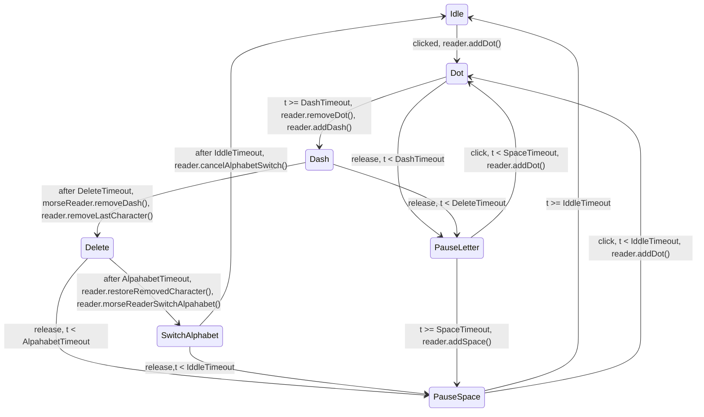
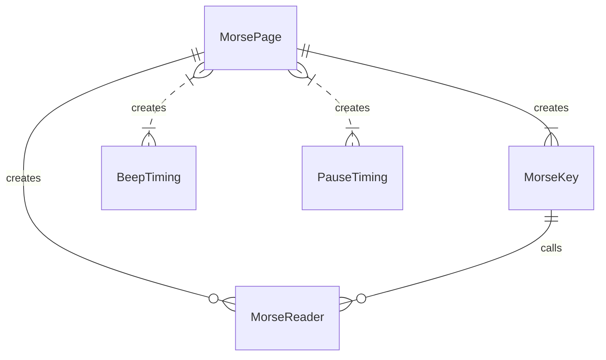

# Morse Trainer Website

Simple webpage for [android morsetrainer](https://github.com/maxistar/morsetrainer)

The urls is [morse.maxistar.me](https://morse.maxistar.me/)

## Online Key State Diagram

### Key State Diagram:

### Entity relations Diagram:

## Issues

[Issues](https://github.com/maxistar/morsetrainer/issues)

